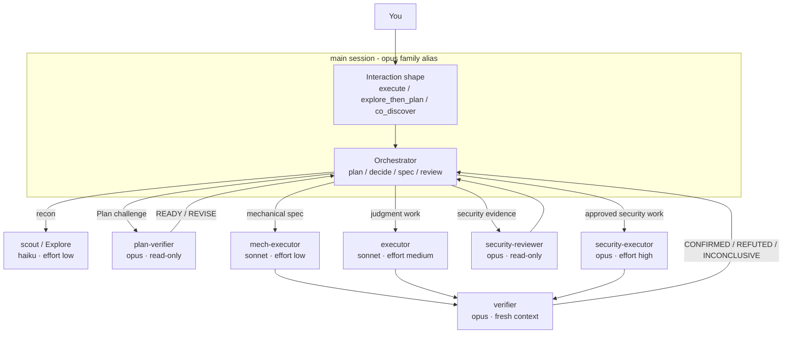

# pilotfish 🐟

> Small, fast role agents handle volume work while the frontier main session
> keeps planning, approval, integration, and final judgment.

**pilotfish** is a multi-model orchestration policy for
[Claude Code](https://code.claude.com), installed **per project**. The main
session runs on the `opus` family; Sonnet and Haiku handle bounded execution
and reconnaissance; fresh Opus contexts handle risk-triggered review.

Nothing is written to `~/.claude/`. No plugin is registered, no hook runs, and
no shell executes at session start. An install is eight agent files, one policy
block, and an optional model setting, all inside the project you choose.

This is a personal fork of
[Nanako0129/pilotfish](https://github.com/Nanako0129/pilotfish), reworked from
global installation to project scope. See [CHANGELOG.md](./CHANGELOG.md) for
what diverged.

## Contents

- [Why](#why)
- [How it works](#how-it-works)
- [Install](#install)
- [Operate](#operate)
- [Documentation](#documentation)
- [Project](#project)

## Why

Most coding-session tokens are spent on search, repetitive edits, tests, and
documentation rather than frontier judgment. pilotfish routes those bounded
paths to cheaper roles while keeping the main session accountable and using
fresh-context reviewers at material acceptance boundaries.

Per-project scoping means repositories where you do not want this are entirely
unaffected, and the whole installation is plain text you can diff, commit, and
revert with the repo.

The default main session is the `opus` alias; Fable remains an explicit
`/model fable` choice. This is a cost-aware default, not a claim that one model
wins every task. The rationale and measurements live in
[research](./docs/research.md) and the [design notes](./docs/design.md).

## How it works

Three layers, all inside one project:

| Layer | Installed target | Responsibility |
|---|---|---|
| Machine | `<project>/.claude/settings.local.json` | Main-model alias and fallback chain (optional) |
| Roles | `<project>/.claude/agents/*.md` | Model, effort, and capability boundary for each role |
| Policy | `<project>/CLAUDE.md` | Dispatch, approval, verification, and long-run behavior |



| Role | Model | Effort | Purpose |
|---|---|---|---|
| `scout` | haiku | low | Read-only repository reconnaissance |
| `Explore` | haiku | low | Broad read-only search without inheriting the main model |
| `plan-verifier` | opus | medium | Pre-approval Plan challenge: `READY` or structured `REVISE` |
| `security-reviewer` | opus | high | Read-only security evidence before approval |
| `mech-executor` | sonnet | low | Fully specified mechanical repetition |
| `executor` | sonnet | medium | Approved implementation requiring local judgment |
| `verifier` | opus | medium | Fresh-context outcome falsification after implementation |
| `security-executor` | opus | high | Approved security-sensitive implementation |

Before direct/delegated routing, pilotfish chooses the first matching
interaction shape: `co_discover` while the outcome or acceptance is unclear;
otherwise `explore_then_plan` when a clear direction is broad or high-impact;
otherwise `execute` for a clear bounded outcome. This changes how the main
session collaborates; it does not bypass risk or approval gates. See the
[design details](./docs/design.md#interaction-shape-before-worker-routing).

Small, stable work stays in the main session. Larger work is split only when a
bounded role has a stable contract and delegation has positive net benefit.
Risk, not file count, triggers independent review. The exact lifecycle is
defined in the [policy template](./templates/claude-md.orchestration.md) and
explained in the [design rationale](./docs/design.md).

> ⚠️ **Automatic delegation is not guaranteed.** Higher-priority Claude Code
> instructions can suppress Agent dispatch. When the lifecycle matters, include
> the following request.

```text
Use pilotfish. Follow its dispatch brake: keep direct work in the main session
and call the named agents only when the policy selects delegation.
```

## Install

Clone this repository, then start Claude Code **in the project you want
pilotfish in** and point it at the runbook:

```bash
git clone https://github.com/alexeynesteruk/pilotfish.git ~/Documents/pilotfish
cd /path/to/your/project
claude
```

```text
Read ~/Documents/pilotfish/install/PROJECT-INSTALL.md and follow it to install
pilotfish into this project. Show me the full plan of changes and get my
approval before writing anything.
```

> **Runtime requirement:** Claude Code **2.1.219 or newer**, for enforced agent
> `tools` allowlists. Start a new session in the project after installing so the
> agents directory and project memory are read.

> ⚠️ **Trust boundary:** the policy loads into every session in that project.
> Review the [agent templates](./templates/agents/), the
> [policy template](./templates/claude-md.orchestration.md), and the
> [install runbook](./install/PROJECT-INSTALL.md) before approving writes.

| Target | Installed change | Reversible |
|---|---|---|
| `.claude/agents/` | Eight role-agent files | Yes |
| `CLAUDE.md` | One versioned `pilotfish:begin/end` policy block | Yes |
| `.claude/settings.local.json` | Optional `model` and `fallbackModel` for this project | Yes |

The installer is idempotent and shows a merge plan before writing. Steps,
backups, collision handling, verification, updates, and uninstall are all in
[install/PROJECT-INSTALL.md](./install/PROJECT-INSTALL.md).

Repeat the install per project. Projects are independent: nothing is shared
between them, and a project without the policy block behaves like stock Claude
Code.

### Optional: a local model as the executor

[`bin/qwen-exec.sh`](./bin/qwen-exec.sh) runs a local Qwen model as an
execution route alongside the Claude roles: brief in, isolated git worktree,
mechanical scope check, acceptance command, patch out. On-prem tokens are free,
so the high-volume half of a session costs nothing. See
[docs/qwen-executor.md](./docs/qwen-executor.md).

### A note on committing it

`.claude/agents/` and `CLAUDE.md` are normally committed, so teammates who
clone the repo inherit the roles and the policy. That is useful for a team that
wants the same lifecycle, and unwanted otherwise. Keep the model pin in
`.claude/settings.local.json` (git-ignored) rather than `.claude/settings.json`
so you never change a teammate's model or spend.

## Operate

| Task | Where to go |
|---|---|
| Install into a project | [Install runbook](./install/PROJECT-INSTALL.md) |
| Tune models, effort, delegation, or managed settings | [Usage guide](./docs/usage.md) |
| Add a `/pilotfish` activation shortcut | [Activation guide](./install/ACTIVATION-INSTALL.md) |
| Update an existing install | [Runbook: Updating an existing install](./install/PROJECT-INSTALL.md#updating-an-existing-install) |
| Review changes in this fork | [CHANGELOG.md](./CHANGELOG.md) |
| Disable pilotfish for a project | Remove the `pilotfish:begin/end` block from that project's `CLAUDE.md` |
| Uninstall safely | [Runbook: Uninstall](./install/PROJECT-INSTALL.md#uninstall) |

To delegate uninstall to Claude Code, from inside the project:

```text
Read ~/Documents/pilotfish/install/PROJECT-INSTALL.md and follow its Uninstall
section for this project: remove the eight pilotfish agent files from
.claude/agents/ and the policy block from CLAUDE.md. Show me the full removal
plan and get my approval before writing.
```

## Documentation

| Topic | Document |
|---|---|
| Daily use and troubleshooting | [docs/usage.md](./docs/usage.md) |
| Architecture and policy decisions | [docs/design.md](./docs/design.md) |
| Running a local Qwen model as an executor | [docs/qwen-executor.md](./docs/qwen-executor.md) |
| Model economics and source research | [docs/research.md](./docs/research.md) |

## Project

pilotfish is MIT licensed. This fork credits
[Nanako0129/pilotfish](https://github.com/Nanako0129/pilotfish); see
[LICENSE](./LICENSE) for the original copyright notice.

[License](./LICENSE)
