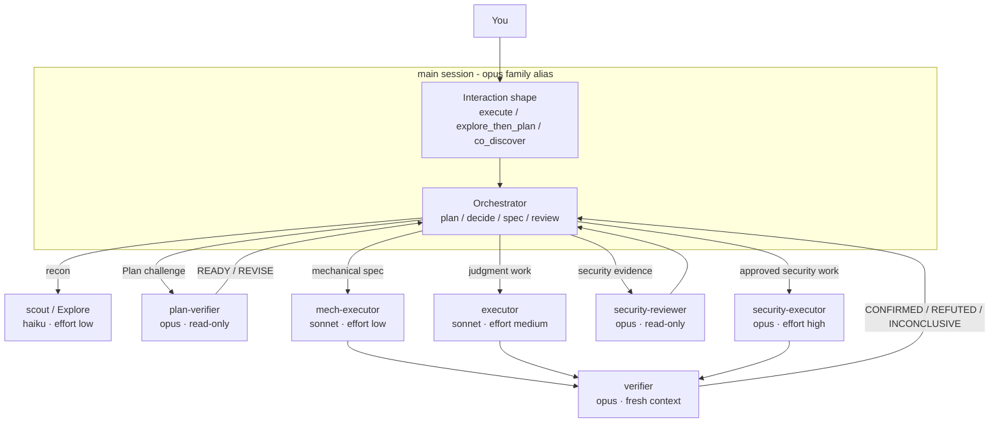

# pilotfish 🐟

> Small, fast role agents handle volume work while the frontier main session
> keeps planning, approval, integration, and final judgment.

**pilotfish** is a multi-model orchestration policy for
[Claude Code](https://code.claude.com). The [macOS and Linux Plugin beta](./install/PLUGIN-INSTALL.md)
adds hook-based ambient activation; the global configuration install remains a
legacy alternative. The policy uses the `opus` family for the main session,
Sonnet and Haiku for bounded execution and reconnaissance, and fresh Opus
contexts for risk-triggered review.

This is a personal, trimmed fork of
[Nanako0129/pilotfish](https://github.com/Nanako0129/pilotfish). The role
policy, agent templates, and install runbooks are unchanged; removed are the
benchmark evidence suite, the contributor test harness, translated docs,
sponsorship links, and upstream-only governance files. See
[CHANGELOG.md](./CHANGELOG.md) for exactly what changed.

## Contents

- [Why](#why)
- [How it works](#how-it-works)
- [Install](#install)
- [Operate](#operate)
- [Documentation](#documentation)
- [Project](#project)

## Why

Most coding-session tokens are spent on search, repetitive edits, tests, and
documentation rather than frontier judgment. pilotfish routes those bounded
paths to cheaper roles while keeping the main session accountable and using
fresh-context reviewers at material acceptance boundaries.

New installs default to the `opus` alias; Fable remains an explicit
`/model fable` choice. This is a cost-aware default, not a claim that one model
wins every task. The rationale and measurements live in
[research](./docs/research.md) and the [design notes](./docs/design.md).

## How it works

The Plugin beta packages the policy and namespaced roles under Claude Code's
native Plugin lifecycle. The legacy global install uses these direct targets:

| Layer | Installed target | Responsibility |
|---|---|---|
| Machine | `~/.claude/settings.json` | Main-model alias and fallback chain |
| Roles | `~/.claude/agents/*.md` | Model, effort, and capability boundary for each role |
| Policy | `~/.claude/CLAUDE.md` | Dispatch, approval, verification, and long-run behavior |

If `CLAUDE_CONFIG_DIR` is set, all `~/.claude/` paths above move under that
configuration root.



| Role | Model | Effort | Purpose |
|---|---|---|---|
| `scout` | haiku | low | Read-only repository reconnaissance |
| `Explore` | haiku | low | Broad read-only search without inheriting the main model |
| `plan-verifier` | opus | medium | Pre-approval Plan challenge: `READY` or structured `REVISE` |
| `security-reviewer` | opus | high | Read-only security evidence before approval |
| `mech-executor` | sonnet | low | Fully specified mechanical repetition |
| `executor` | sonnet | medium | Approved implementation requiring local judgment |
| `verifier` | opus | medium | Fresh-context outcome falsification after implementation |
| `security-executor` | opus | high | Approved security-sensitive implementation |

Before Baton or direct/delegated routing, pilotfish chooses the first matching
interaction shape: `co_discover` while the outcome or acceptance is unclear;
otherwise `explore_then_plan` when a clear direction is broad or high-impact;
otherwise `execute` for a clear bounded outcome. This changes how the main
session collaborates; it does not bypass risk or approval gates. See the
[design details](./docs/design.md#interaction-shape-before-worker-routing).

Small, stable work stays in the main session. Larger work is split only when a
bounded role has a stable contract and delegation has positive net benefit.
Risk, not file count, triggers independent review. The exact lifecycle is
defined in the [policy template](./templates/claude-md.orchestration.md) and
explained in the [design rationale](./docs/design.md).

> ⚠️ **Automatic delegation is not guaranteed.** Higher-priority Claude Code
> instructions can suppress Agent dispatch, and user-level `CLAUDE.md` cannot
> override them. When the lifecycle matters, include the following request.

```text
Use pilotfish. Follow its dispatch brake: keep direct work in the main session
and call the named agents only when the policy selects delegation.
```

## Install

### Plugin beta for macOS and Linux

Use the [Plugin beta install guide](./install/PLUGIN-INSTALL.md) for native
user-scope marketplace commands, migration from global v1, update,
disable/enable, uninstall, and rollback. The experimental beta targets macOS
and Linux. Linux requires Ubuntu 20.04+, Debian 10+, or Alpine Linux 3.19+ and
an otherwise-working officially supported Claude Code installation, per the
[official system requirements](https://code.claude.com/docs/en/setup#system-requirements)
(checked 2026-08-22). macOS with Claude Code 2.1.239 is live-observed. Linux is
contract-qualified only; it has not been tested, verified, or live-observed.
Windows is excluded. SessionStart hooks are required, the Plugin must not
coexist with the legacy global install, and this beta does not claim stable
reliability, cross-version compatibility, or runtime namespace-collision proof.

### Legacy global install

Clone this checkout, start Claude Code from it, and ask it to follow the local
runbook:

```bash
git clone --branch v1.4.1 --depth 1 https://github.com/alexeynesteruk/pilotfish.git
cd pilotfish
claude
```

```text
Read the local file install/AGENT-INSTALL.md in the current checkout and follow
it to install pilotfish into my global Claude Code configuration. Show me the
full plan of changes and get my approval before writing anything.
```

> **Runtime requirement:** Claude Code **2.1.219 or newer**. Restart Claude Code
> after installation so the agent directory and model setting are reloaded.

> ⚠️ **Trust boundary:** the policy loads into every future session. Review the
> pinned checkout, the [agent templates](./templates/agents/), the
> [policy template](./templates/claude-md.orchestration.md), and the
> [install runbook](./install/AGENT-INSTALL.md) before approving writes. Do not
> bypass WebFetch prompt-injection protection to install from a mutable raw URL.

| Target | Installed change | Reversible |
|---|---|---|
| `settings.json` | Adds missing `model` and `fallbackModel`; conditionally extends an existing `availableModels` allowlist | Restores or removes `model`; `fallbackModel` is removable, while allowlist additions remain unless requested |
| `agents/` | Eight role-agent files | Yes |
| `CLAUDE.md` | One versioned `pilotfish:begin/end` policy block | Yes |

The installer is idempotent and shows a merge plan before writing. Human-readable
steps, backups, collision handling, verification, updates, and uninstall are all
in [install/AGENT-INSTALL.md](./install/AGENT-INSTALL.md).

## Operate

| Task | Where to go |
|---|---|
| Install, update, disable, or remove the macOS and Linux Plugin beta | [Plugin beta guide](./install/PLUGIN-INSTALL.md) |
| Tune models, effort, delegation, or managed settings | [Usage guide](./docs/usage.md) |
| Activate pilotfish for a task or session | [Install `/pilotfish` or the CLI wrapper](./install/ACTIVATION-INSTALL.md) |
| Update an existing install | [Runbook: Updating an existing install](./install/AGENT-INSTALL.md#updating-an-existing-install) |
| Review release changes | [CHANGELOG.md](./CHANGELOG.md) |
| Disable pilotfish for one project | Use a separate `CLAUDE_CONFIG_DIR`; details are in the [usage guide](./docs/usage.md#disable-update-or-uninstall) |
| Uninstall safely | [Runbook: Uninstall](./install/AGENT-INSTALL.md#uninstall) |

To delegate uninstall to Claude Code:

```text
Read the local install/AGENT-INSTALL.md, resolve the Claude Code configuration
root exactly as Step 0 specifies, and follow its Uninstall section. In that
configuration root, remove the eight pilotfish agent files and policy block.
Show me the full removal and settings-restoration plan and get my approval
before writing.
```

## Documentation

| Topic | Document |
|---|---|
| Daily use and troubleshooting | [docs/usage.md](./docs/usage.md) |
| Architecture and policy decisions | [docs/design.md](./docs/design.md) |
| Model economics and source research | [docs/research.md](./docs/research.md) |

## Project

pilotfish is MIT licensed. This fork is forked from and credits
[Nanako0129/pilotfish](https://github.com/Nanako0129/pilotfish); see
[LICENSE](./LICENSE) for the original copyright notice.

[License](./LICENSE)
