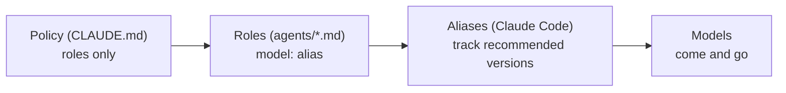

# pilotfish — Design Rationale

## Purpose

This document explains *why* pilotfish is shaped the way it is: three layers, role-based policy, aliases everywhere, effort tiers, and a verification gate. The empirical grounding (official docs, measured community numbers, subscription economics) lives in the [research report](./research.md); this is the argument from those facts to this design.

## The three layers

The core observation is that "who orchestrates", "who executes what", and "how delegation behaves" change at different rates and should therefore live in different places:

| Layer | File | Changes when | Mechanism |
|---|---|---|---|
| Machine | `<project>/.claude/settings.local.json` | Your main-model policy changes | `model: "opus"` + `fallbackModel: ["sonnet"]` |
| Roles | `<project>/.claude/agents/*.md` | A model tier is re-pointed | One `model:` line of frontmatter per role |
| Policy | `<project>/CLAUDE.md` | Your working style changes | Prose rules written against role names |

CLAUDE.md cannot set the main-session model (that is a settings/`/model` concern), which turns out to be a feature: it forces the clean split where settings decide *who* orchestrates and CLAUDE.md decides *how* it delegates.

All three layers live inside one project. That is a deliberate departure from
upstream pilotfish, which installs the same three layers globally under
`~/.claude/`. Per-project scoping costs one copy step per repository and buys
three things: repositories where you do not want role delegation are entirely
unaffected, the model pin travels with the project rather than every session on
the machine, and the whole installation is reviewable plain text you can diff
and revert with the repo. The tradeoff is real - eight files and a policy block
per project, and no ambient activation outside them.

## Role-based policy, model-free prose

The single most important rule in pilotfish: **the policy text never names a model.** It says "delegate mechanical work to `mech-executor`", not "delegate to Sonnet". Model bindings exist in exactly one place — the frontmatter of each agent file.

This is what makes the fallback story degenerate into no-ops:

The June 2026 export-control suspension was a live test of alias resilience: accounts on aliases degraded gracefully, while users who pinned the full `claude-fable-5` model ID got hard 404 errors. The same principle applies to the current default. `opus` follows the provider's current Opus release, every role keeps its binding, and the policy text remains model-agnostic. A user who deliberately selects `best`, `fable`, a full model ID, or another alias keeps that choice because the installer never replaces an existing value without approval.

Three distinct failure modes get three distinct mechanisms — they are often conflated but shouldn't be:

| Failure | Mechanism | Layer |
|---|---|---|
| Primary model *overloaded / unavailable* | `fallbackModel: ["sonnet"]` | settings |
| Model *deprecated* | aliases in role frontmatter | agents |
| User wants a different frontier trade-off | explicit `/model` choice, preserved by the installer | settings |

## Why these eight roles

The role set is the smallest one that covers the delegation patterns that actually recur, mapped to the cheapest tier that reliably handles each:

| Role | Tier argument |
|---|---|
| `scout`, `Explore` | Reconnaissance is the highest-volume, lowest-judgment token sink in a coding session (telemetry showed ~36% of calls were exploration even before deliberate routing). For *locating* facts — not judging them — Haiku at low effort is effectively equivalent; judgment stays with the orchestrator. Both roles carry a positive `tools: Read, Glob, Grep` allowlist, so "read-only" is enforced, not just prompted. |
| `plan-verifier` | Material Plans benefit from fresh-context challenge before approval, but that phase cannot rely on a prompt-only no-write promise. Its positive `tools: Read, Glob, Grep` allowlist enforces the boundary while Opus supplies the judgment needed to return `READY` / `REVISE`. |
| `security-reviewer` | Pre-approval security evidence needs Opus-level judgment and an actually read-only surface. Its allowlist permits repository and external advisory reads while excluding Bash and every write-capable tool. |
| `mech-executor` | Fully-specified work has its judgment already done — by the orchestrator, in the spec. Sonnet executes specs faithfully, and on subscriptions it additionally draws on the dedicated Sonnet-only weekly bucket (extra headroom on top of the shared all-models limit). |
| `executor` | Real implementation needs local design judgment and is also the default volume implementation path. Sonnet keeps that path below an Opus main-loop fallback instead of paying Opus subagent cost with no tier saving. This is a routing and cost-tier decision, not evidence that Sonnet is universally better for the role; no role-specific Opus-versus-Sonnet executor benchmark has been run. |
| `verifier` | Official guidance: independent fresh-context verifiers outperform self-critique. After implementation it retains Bash to reproduce tests and returns calibrated `CONFIRMED` / `REFUTED` / `INCONCLUSIVE`, while write tools stay disabled — a verifier that fixes work stops being independent. |
| `security-executor` | Approved security implementation deserves consistently high effort, and the frontier model's safety classifiers can refuse benign defensive-security work mid-task. Pre-routing it to Opus makes the refusal path unreachable instead of handled. It is intentionally separate from the read-only pre-approval reviewer. |

The `Explore` override exists because Claude Code v2.1.198 changed the built-in Explore agent to inherit the main-session model — on a frontier main session, that silently upgrades your cheapest workload to your most expensive model. A same-name user-level agent shadows it.

## Quality: verification over executor pedigree

The intuitive objection to cheap executors is quality. pilotfish's answer is structural, not hopeful:

1. The orchestrator writes complete one-shot Plans and execution specs (goal, constraints, done-criteria, the *why*) — most cheap-model failures are actually spec failures.
2. Material Plans use a program envelope plus independently approvable slices. When concrete security, irreversible/external, data, release, or cross-component acceptance risk justifies independent review, a tool-enforced read-only `plan-verifier` reviews the envelope, then only the next executable slice.
3. Escalation is bounded: two failed attempts on a tier, then escalate or take over. No infinite cheap retries that burn more than they save.
4. Risk-triggered completed work passes through `verifier` after the primary acceptance flow has been exercised; routine local work does not spawn review merely because it is called non-trivial.

Fresh verification isn't free — both verification roles run on Opus and re-read context in a fresh session. With an Opus main session this is a same-tier quality boundary, not a model-cost saving. Role verdicts are evidence, not implementation or scope authority: the main session records `FIX`, `DEFER`, or `REJECT` for every finding. `REVISE` returns all known claim-relevant P0-P2 blockers in one pass; P3/P4, optional detail, and adjacent hardening do not block. `CONFIRMED` requires evidence for every acceptance condition, `REFUTED` requires a reproducible claim-blocking failure, and `INCONCLUSIVE` preserves uncertainty. Security Plans retain the dedicated read-only `security-reviewer`.

Readiness is tracked per stable envelope or slice. `READY` is bare; `REVISE`
names each blocker, evidence, minimum revision, and acceptance check. Two
automatic revisions for one unit are the limit before the main session stops
automatic resubmission and dispositions the blockers, narrows or splits the
unit, and continues independent slices. A material `FIX`, narrowing/split, or
evidence-backed disposition that changes the readiness claim records a new
readiness epoch and gets exactly one final fresh `plan-verifier` check; that closing check cannot
restart the automatic loop, and another `REVISE` pauses or escalates by
severity. User input is reserved for unresolved P0/P1, product or authority
choices, or an original scope that can no longer be met.

Before likely long autonomous work, the main session names `AUTO` or `ASK` for the current task. `AUTO` keeps moving only through approved, reversible scope; it does not manufacture commit, publish, destructive, external-action, or spending authority. `ASK` uses native input when available and otherwise stops at `PAUSED_NEEDS_USER`; `/goal` preserves an objective, not authority.

P0 freezes the affected slice and dependents, while cross-cutting risk stops the program. Introduced P2 regressions remain blocking rather than being hidden by a narrowed claim. Normal recovery is one targeted recheck of the original reproduction plus a bounded basic regression. Five meaningful P1/P2 passes remain an emergency ceiling for high-risk, claim-critical recovery, never a quota; stop earlier when another pass would only search adjacent risk. Verification identity still prevents duplicate rechecks, and exhaustion pauses only the affected slice when risk is not cross-cutting.

## Interaction shape before worker routing

> Source: this three-mode interaction design is adapted from
> [pilotfish-codex's adaptive intent routing](https://github.com/miyago9267/pilotfish-codex/pull/14)
> by [@miyago9267](https://github.com/miyago9267). pilotfish retains its own
> approval, verification, and worker-routing contracts.

pilotfish chooses the first matching mode below, then applies the existing risk, lifecycle, and delegation rules:

| Mode | Use when | Next move |
|---|---|---|
| `co_discover` | The outcome or acceptance is unclear | Ask only direction-changing questions; otherwise run the smallest reversible probe |
| `explore_then_plan` | Otherwise, the direction is clear and broad or high-impact | Ground the facts, then propose the next reversible slice |
| `execute` | Otherwise, the outcome is clear and bounded | Continue through the existing gates |

Interaction selection occurs before Baton or worker routing; it does not grant authority. Existing approval boundaries still apply, and discovery stops when more evidence cannot change the next gate.

## Phase-specific dispatch brakes

Role routing answers *which worker* should receive eligible work; it does not answer *what phase the task is in* or *whether spawning a worker is beneficial*. pilotfish therefore applies a different contract to discovery and execution instead of requiring a finished implementation outcome before any delegation.

| Phase | Stable before delegation | Main-session responsibility |
|---|---|---|
| Discovery | Question, allowed scope, evidence format, stop condition | Reconcile evidence and decide what it means |
| Plan | Evidence is sufficient to define outcome, non-goals, dependencies, ownership, sequence, verification, budgets, and stops | Synthesize one Plan and revise it after any readiness review |
| Approval | Material Plan is visible to the user | Wait for explicit approval before source writes or implementation briefs |
| Execution | Scope, exclusive ownership, constraints, done criteria, integration, verification | Integrate results and resolve architecture forks |
| Verification | Implementation is concrete enough to refute | Make the final judgment after independent evidence returns |

Within each phase's safety boundary, pilotfish chooses by net benefit across model cost, scarce context, elapsed time, isolation, and fresh independence versus reconstruction, coordination, integration, and verification cost. Delegation does not have to win every axis: a bounded cheap worker can be useful despite a small latency penalty.

A planning skill such as [Baton](https://github.com/cablate/baton) composes above this role layer. It may shape discovery questions, worker count, ownership, sequence, budgets, and stop conditions. pilotfish supplies the named Claude roles, model routing, leaf-agent boundary, approval gate, and verifier contract. Final Plan synthesis and judgment stay in the main session.

This distinction matters most during exploratory debugging. Runtime traces, root-cause hypotheses, patch anchors, and live verification often form one tightly coupled code path. Handing the middle of that chain to a fresh executor makes the executor rebuild context while the orchestrator waits, then makes the orchestrator rebuild enough context to integrate the answer. Such one-path work remains in the main session; one unknown bug must not become a sequential scout-to-executor pipeline. A large cross-surface investigation can still use bounded read-only discovery, but it returns to main-session Plan synthesis before execution.

A bounded task-local repository scan stays inline by default because worker startup and synthesis are real costs. Read-only discovery may still fan out when surfaces require substantial independent scanning, external or tool latency overlaps, or independently gathered evidence materially reduces Plan uncertainty. Directory boundaries alone do not decide the topology. Stable multi-file repetition remains a positive path to the cheap mechanical role, while fresh Plan and outcome verification retain independent quality boundaries.

Long-running process ownership follows the same closure rule. Every Bash-capable leaf role (`mech-executor`, `executor`, `verifier`, `security-executor`) runs bounded foreground commands and never detaches from harness tracking. If a command cannot finish within its 10-minute ceiling, it returns the exact command, absolute worktree or working directory, required environment, and input paths to the main orchestrator. The orchestrator owns tracked background execution in that exact context rather than the parent checkout, then re-tasks the leaf with the result. An agent likely to cross a command timeout must itself run in the background: a promoted command survives and notifies there, while the same command under a foreground-spawned agent is terminated after the agent returns.

Result collection closes the same loop from the other direction. A subagent's final message is its deliverable, and the orchestrator *pulls* it from the finished task — the harness captures it on completion rather than the agent pushing it. This matters most for the read-only recon and review roles, whose positive read-only tool allowlists exclude outbound messaging: asking one to relay findings already present in its completed output, or relaunching it to make those results "return directly," is a category error that pays the discovery cost twice. That capability boundary does not prohibit parent-driven continuation. The message channel can probe a still-running task, redirect it, or resume a custom agent with retained context for genuinely new work; the new run then produces another final message. It is never the collection path for an existing result. Coordination stays a star — each run's final findings flow leaf → orchestrator, never leaf → leaf.

## Effort tiers

Effort is the second big quota lever after model choice, and the Fable-5 generation shifted the calculus: low effort on current models routinely matches previous-generation `xhigh`. pilotfish therefore pairs every role with an effort:

| Role class | Effort | Why |
|---|---|---|
| Recon (`scout`, `Explore`) | `low` | High volume, near-zero judgment |
| Mechanical (`mech-executor`) | `low` | Judgment lives in the spec |
| Judgment (`executor`, `plan-verifier`, `verifier`) | `medium` | Balance point |
| Security (`security-reviewer`, `security-executor`) | `high` | Correctness over cost |
| Main session | `high` (user setting) | Judgment-heavy orchestration; users can lower it when quota or latency matters more |

## Deliberately left out

| Not included | Why |
|---|---|
| Per-project configuration | The six projects audited before building this had zero model policy in their CLAUDE.md files — correctly. A single global source of truth is the whole point; project files stay pure technical notes. |
| Enforcement hooks (spawn guards, stop guards à la fable5-orchestrator) | Powerful but heavy; policy-only works well before adding machinery. If discipline slips, hooks are the documented next step — see the research report. |
| `CLAUDE_CODE_SUBAGENT_MODEL` | A global default for subagents, which is the opposite altitude from per-role tiering. On 2.1.252 it fills in only where frontmatter is silent, so it does not break these roles; the installer still reports it because it retiers every other subagent. |
| Pinned model IDs | Pinning trades resilience for reproducibility; for a personal global config, resilience wins. Organizations that need pinning have `ANTHROPIC_DEFAULT_*_MODEL`. |
| An `opusplan` default | It's a great quota-saver but changes interactive feel (model switches mid-conversation). Offered as an opt-in in the FAQ instead. |
| Installer profiles or main-loop autodetection | The default main session is now explicitly Opus and the default implementation path is Sonnet. A second tier map would double the installer surface without improving that common path; users who opt into another main model can still edit one role alias if needed. |

The "smart brain, cheap hands" split predates pilotfish: Anthropic documents the
same architecture in [Decoupling the brain from the hands](https://www.anthropic.com/engineering/managed-agents),
Claude Code already ships [`opusplan`](https://code.claude.com/docs/en/model-config),
and [Rylaa/fable5-orchestrator](https://github.com/Rylaa/fable5-orchestrator)
offers a hook-enforced variant. pilotfish's scope is the compact role policy,
review-before-write installer, and evidence-bounded compatibility claims.

## Prompting style inside the agents

The agent system prompts follow the current-generation guidance from the research: goals and constraints instead of step-by-step scaffolding, an explicit statement of what *not* to do (no scope creep, verifier never fixes), evidence-audited progress claims, and "a precise *blocked because X* is a successful outcome" to prevent guessing. When editing the templates, keep that register — prescriptive checklists measurably degrade current-generation output.
